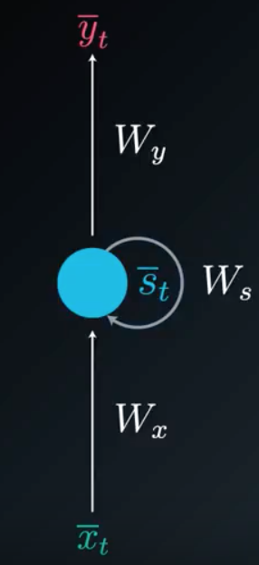

# Recurrent Neural Networks

- intro
  - have memory, can use past inputs to generate current outputs
  - temporal dependencies : involve current and past inputs
- history
  - temporal data in world is abundant in video, speech, text, and feedforward was bad at capturing temporal relationships
  - time delay NN : tried to capture temporal info, but was limited to set time window size
  - simple RNN (elman network) : suffered from vanishing gradient problem
  - **vanishing gradient problem : cannot capture information 8-10 steps backward, due to backpropagation and the fact that the gradient is multiplied by derivatives, if derivatives are <1, a convergent geometric series is created and the gradient diminishes rapidly**
  - LSTM : address vanishing gradient problem
- applications
  - speech recognition
  - time series prediction (traffic = waze, movie selection = netflix, stock market conditions = hedge funds)
  - NLP (translation)
  - gesture recognition (recognizing human gesture from video)
- differences (RNN and normal NN)
  - train with sequences : previous input matters
  - memory elements : output of hidden layer that serve as input to network at next train step
  - s (not h) : for hidden layers to represent states of memory
- representing RNNs
  - folded : compact representation where the memory is shown as a state that simply loops back
  - Folded Diagram: 
  - unfolded : less compact representation where each output is shown connect to hidden nodes, and hidden nodes connect to corresponding inputs and previous hidden nodes (showing time at $$t-1,t,t+1,\ldots$$)
  - Un-folded Diagram: 
  - $$\bar{x}_{t}$$ : inputs at time $$t$$
  - $$\bar{y}_{t}$$ : outputs at time $$t$$
  - $$\bar{s}_{t}$$ : state (memory) at time $$t$$
  - $$W_{x}$$ : weights of input to state
  - $$W_{s}$$ : weights of previous state to current state
  - $$W_{y}$$ : weights of state to output respectively
  - $$\phi$$ : arbitrary activation function
  - $$\bar{s}_{t}=\phi(\bar{x}_{t}\cdot W_{x} + \bar{s}_{t-1}\cdot W_{s})$$
  - $$\bar{y}_{t}=\bar{s}_{t}\cdot W_{y}$$
- RNN variations
  - CNN/RNN : first few layers conv, flatten, then LSTM recurrent layers, and you can have convolutional neural networks that have memory
  - RNN with multiple inputs or outputs, RNN connected to another RNN
- misc

## Backpropagation Through Time (BTT)
*method to train RNN at specific time point $$t$$, while taking into account previous time points*

*given the simple RNN provided in diagrams above*

### Sample Calculation

The partial derivatives of error, specifically at time $$t=3$$, with respect to every weight matrix :

$$\begin{align}
  \frac{\partial E_3}{\partial W_y} &= \frac{\partial E_3}{\partial \bar{y}_3}\frac{\partial \bar{y}_3}{\partial W_y}\\\\
  \frac{\partial E_3}{\partial W_s} &= \frac{\partial E_3}{\partial \bar{y}_3}\frac{\partial \bar{y}_3}{\partial \bar{s}_3}\frac{\partial \bar{s}_3}{\partial W_s} +\\
    &\phantom{000}\frac{\partial E_3}{\partial \bar{y}_3}\frac{\partial \bar{y}_3}{\partial \bar{s}_3}\frac{\partial \bar{s}_3}{\partial \bar{s}_2}\frac{\partial \bar{s}_2}{\partial W_s}+\\
    &\phantom{000}\frac{\partial E_3}{\partial \bar{y}_3}\frac{\partial \bar{y}_3}{\partial \bar{s}_3}\frac{\partial \bar{s}_3}{\partial \bar{s}_2}\frac{\partial \bar{s}_2}{\partial \bar{s}_1}\frac{\partial \bar{s}_1}{\partial W_s}\\\\
  \frac{\partial E_3}{\partial W_x} &= \frac{\partial E_3}{\partial \bar{y}_3}\frac{\partial \bar{y}_3}{\partial \bar{s}_3}\frac{\partial \bar{s}_3}{\partial W_x} +\\
    &\phantom{000}\frac{\partial E_3}{\partial \bar{y}_3}\frac{\partial \bar{y}_3}{\partial \bar{s}_3}\frac{\partial \bar{s}_3}{\partial \bar{s}_2}\frac{\partial \bar{s}_2}{\partial W_x}+\\
    &\phantom{000}\frac{\partial E_3}{\partial \bar{y}_3}\frac{\partial \bar{y}_3}{\partial \bar{s}_3}\frac{\partial \bar{s}_3}{\partial \bar{s}_2}\frac{\partial \bar{s}_2}{\partial \bar{s}_1}\frac{\partial \bar{s}_1}{\partial W_x}\\
\end{align}$$

#### "Proof."
Just like the [NN chapter](/chapter-1/), when we calculate partial derivative of error with respect to specific set of weights simply:
1. List all equations that are used to calculate hidden nodes, output nodes, error, using the inputs
2. Plug all equations into the error equation, replacing variables
3. Take partial derivative of that error with respect to desired weight
4. Use derivative properties to simplify (especially chain rule)

An alternative to the above method is to:
1. For every neuron (state) where the desired weight contributes to that state, and the state contributes to the error:
   - Use chain rule to construct partial derivative of error with respect to specific desired weight and neuron (state)
2. Calculate overall partial derivative of error with respect to desired weight by:
   - Adding every partial derivative calculated from previous step (we are **accumulating** the **gradient contributions** from all states)

For example:

$$\text{Given the desired weight, } W_s \text{ , calculating } \frac{\partial E_3}{\partial W_s}\text{ :}$$

$$
  s_3 \text{ is a state where } W_s \text{ contributes to } s_3 \text{ , and } s_3 \text{ contributes to } E \\
  \frac{\partial E_3}{\partial W_s} = \frac{\partial E_3}{\partial \bar{y}_3}\frac{\partial \bar{y}_3}{\partial \bar{s}_3}\frac{\partial \bar{s}_3}{\partial W_s}
$$

$$
  s_2 \text{ is a state where } W_s \text{ contributes to } s_2 \text{ , and } s_2 \text{ contributes to } E \\
  \frac{\partial E_3}{\partial W_s} = \frac{\partial E_3}{\partial \bar{y}_3}\frac{\partial \bar{y}_3}{\partial \bar{s}_3}\frac{\partial \bar{s}_3}{\partial \bar{s}_2}\frac{\partial \bar{s}_2}{\partial W_s}
$$

$$
  s_1 \text{ is a state where } W_s \text{ contributes to } s_1 \text{ , and } s_1 \text{ contributes to } E \\
  \frac{\partial E_3}{\partial W_s} = \frac{\partial E_3}{\partial \bar{y}_3}\frac{\partial \bar{y}_3}{\partial \bar{s}_3}\frac{\partial \bar{s}_3}{\partial \bar{s}_2}\frac{\partial \bar{s}_2}{\partial \bar{s}_1}\frac{\partial \bar{s}_1}{\partial W_s}
$$

$$\text{Accumulating gradient contributions from every state:}\\\\$$
$$\begin{align}
  \frac{\partial E_3}{\partial W_s} &= \frac{\partial E_3}{\partial \bar{y}_3}\frac{\partial \bar{y}_3}{\partial \bar{s}_3}\frac{\partial \bar{s}_3}{\partial W_s} +\\
    &\phantom{000}\frac{\partial E_3}{\partial \bar{y}_3}\frac{\partial \bar{y}_3}{\partial \bar{s}_3}\frac{\partial \bar{s}_3}{\partial \bar{s}_2}\frac{\partial \bar{s}_2}{\partial W_s}+\\
    &\phantom{000}\frac{\partial E_3}{\partial \bar{y}_3}\frac{\partial \bar{y}_3}{\partial \bar{s}_3}\frac{\partial \bar{s}_3}{\partial \bar{s}_2}\frac{\partial \bar{s}_2}{\partial \bar{s}_1}\frac{\partial \bar{s}_1}{\partial W_s}\ \ \ \ \blacksquare\\\\
\end{align}$$

### General Formula
The partial derivatives of error, specifically at time $$t=3$$, with respect to every weight matrix :

$$\begin{align}
  \frac{\partial E_N}{\partial W_y} &= \frac{\partial E_N}{\partial \bar{y}_N}\frac{\partial \bar{y}_N}{\partial W_y}\\\\
  \frac{\partial E_N}{\partial W_s} &= \sum_{i=1}^{N}\frac{\partial E_N}{\partial \bar{y}_N}\frac{\partial \bar{y}_N}{\partial \bar{s}_i}\frac{\partial \bar{s}_i}{\partial W_s}\\\\
  \frac{\partial E_N}{\partial W_x} &= \sum_{i=1}^{N}\frac{\partial E_N}{\partial \bar{y}_N}\frac{\partial \bar{y}_N}{\partial \bar{s}_i}\frac{\partial \bar{s}_i}{\partial W_x}\\

\end{align}$$

#### "Proof."
Generalizing the results from the sample calculation it is clear that:

In the general formula for partial derivative of E at any time $$N$$, the latter two derivatives of the summation term ($$\frac{\partial \bar{y}_N}{\partial \bar{s}_i}\frac{\partial \bar{s}_i}{\partial W_s}$$) can be expanded using chain rule to partial derivatives of every state in terms of previous state. $$\blacksquare$$

### Generalizing to Other Weights
- updating weights from input to state is virtually the same except for single partial dervative, the derivative of the state in terms of the weight

### Theory In Application
To avoid calculating the partial derivatives for each state over and over (since after you pass time interval it is static):
1. For each time point $$i$$ (and corresponding state, $$\bar{s}_i$$):
   1. Calculate $$\frac{\partial \bar{s}_i}{\partial W_s}$$
   2. Calculate $$\frac{\partial \bar{s}_i}{\partial \bar{s}_{i-1}}$$
   3. Store calculations
   4. Multiply/add the stored partial derivatives, and current partial derivatives (using chain rule) to get appropriate $$\frac{\partial E}{\partial W_s}$$ at current time $$i$$

### Multi-RNN
If you have an RNN feeding into another RNN memory block:
- the gradients will contribute from __all__ possible states
- including paths that go through current state of 2nd RNN into previous state of that same 2nd RNN into the previous state of the 1st RNN
- so you must accumulate gradients from all possible paths

### MiniBatch Gradient Descent
- update weights once every $$M$$ samples by accumulating gradients and updating with average of accumulation
- $$\delta_{ij}=\frac 1 M \sum_{k=1}^{M}\delta_{ij_k}$$
- reduces complexity
- reduces noise

## Addressing Weaknesses of Simple RNN
- exploding gradient problem : gradient grows uncontrollably
  - [gradient clipping](https://arxiv.org/abs/1211.5063) : addresses problem by normalizing gradients that are above threshold (penalize large gradients)
  - if $$\delta > \text{ threshold}$$: $$\delta = \frac{\text{ threshold}}{\delta}\cdot\delta$$
- many time steps, many layers of hidden neurons (>8 to 10) : cannot accumulate gradient contributions from every time step due to vanishing gradient problem (gradient is too small)
    - solution : LSTM cells instead of standard neurons

## Differences Between Simple RNN and LSTM
*LSTM is simple RNN where all the neurons are replaced with different internal structure, but the unfolded representation is the same, i.e. one state can pass to future states*

Simple RNN neuron:
- computes input times weights, previous state times weights, adds those together, applies activation function ($$\phi$$)
- outputs to next state
- outputs to output after multiplying by output weights

LSTM neuron:
- 1st calculation : sigmoid function ($$\sigma$$)
- 2nd : hyperbolic tangent function (*tanh*)
- 3rd : multiplication ($$\times$$)
- 4th : addition ($$+$$)

LSTM Advantages:
- learning over many time steps
- fully differentiable ($$\sigma, \text{tanh}, \times, +$$)
- easy to train using backprop, SGD
- sigmoid allows all data to flow through when = 1, and no data when = 0, much like real biological neuron
  - can decide which information to store and forget, when to use, when to move previous state to next state's information
  - is a "gating function"
  - can be trained using backprop by adjusting the weights that multiply times inputs before going into sigmoid
